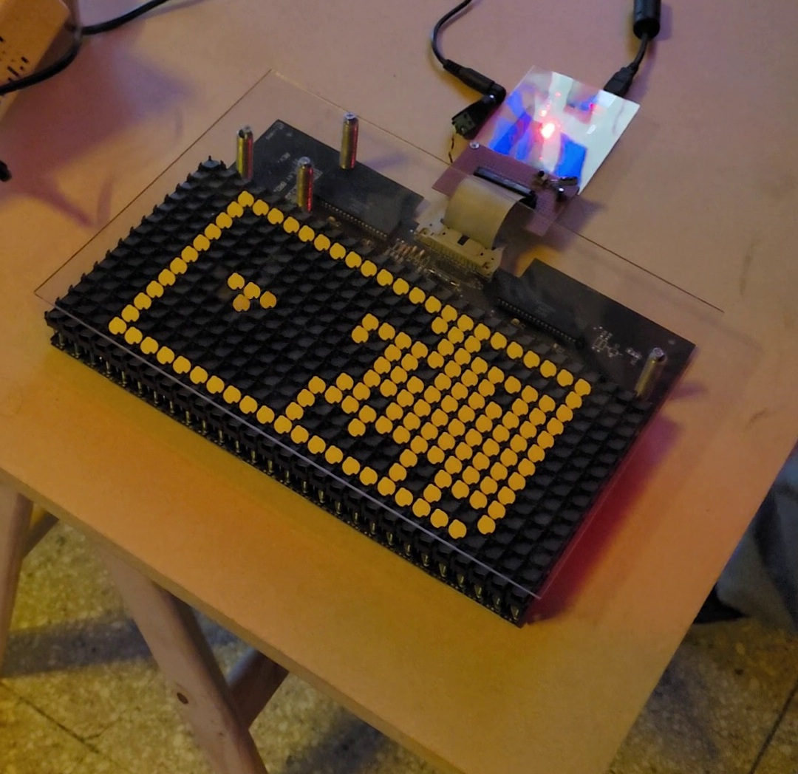

# Flip dot games

## About

This is a game collection for a 28 × 14 Ferranti Packard flip-dot display. The included sketch presents a menu of six arcade-style games:

- Snake
- Tetris
- Frogger
- Bomberman
- Breakout
- A Space Invaders-style shooter

This project has been exhibited at a few Cybercirujas events.

It is based on the original [novarlynx/FP317-Driver](https://github.com/novarlynx/FP317-Driver) project.

## Simulator

An SDL-based local simulator is available in [`sim/`](sim/README.md). It runs the Arduino sketch on a desktop computer and renders the 28 × 14 flip-dot framebuffer, making it useful for developing and testing the games without the physical display. See the [simulator README](sim/README.md) for build instructions and controls.

## Library contents

- FP317_driver is the actual driver that allows for interfacing with the MCU.
- FP317_driver_pins is the configuration file for the driver. Required to operate.
- FP317_gfx is a subclass of Adafruit_GFX (https://github.com/adafruit/Adafruit-GFX-Library) that uses FP317_driver to draw stuff.

This driver was made for the 317 display but could be adapted to any 14 x 28 flip dot display using a pair of FP2800A drivers.
